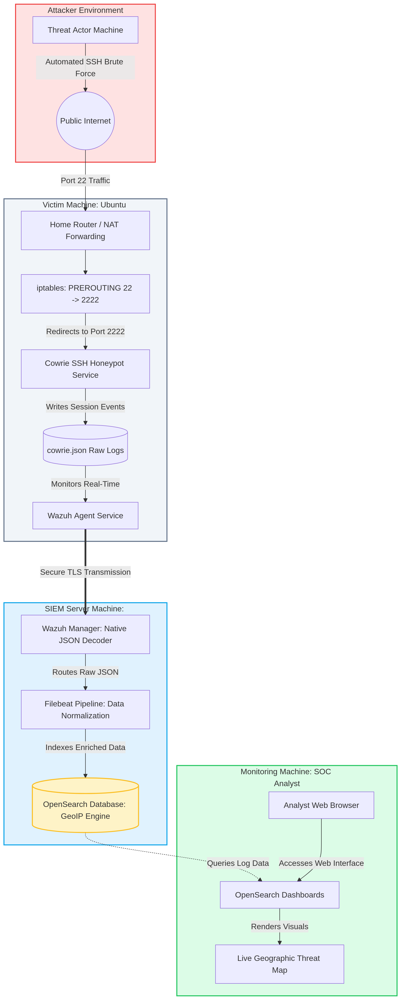
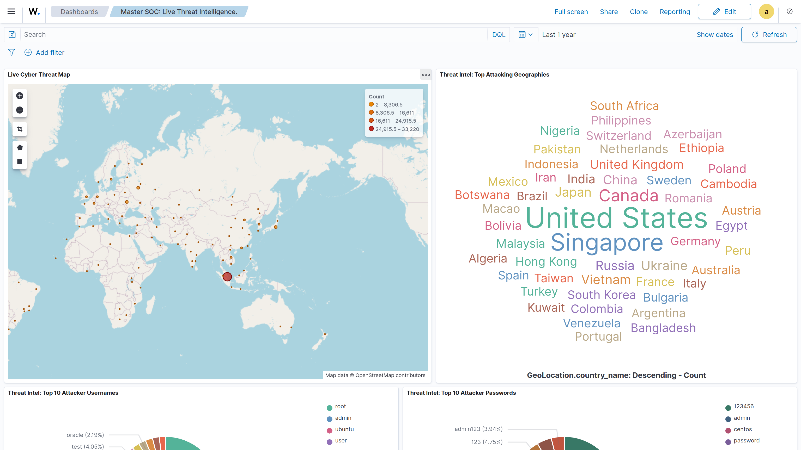
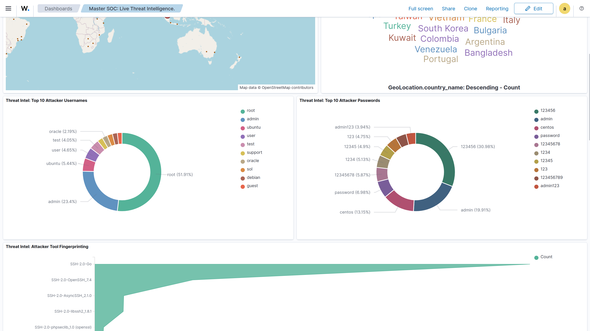
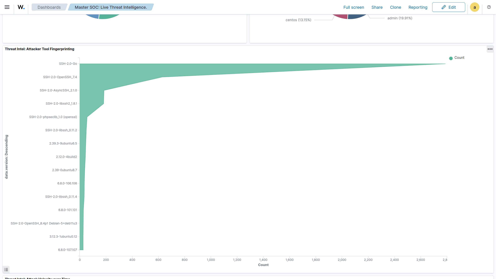
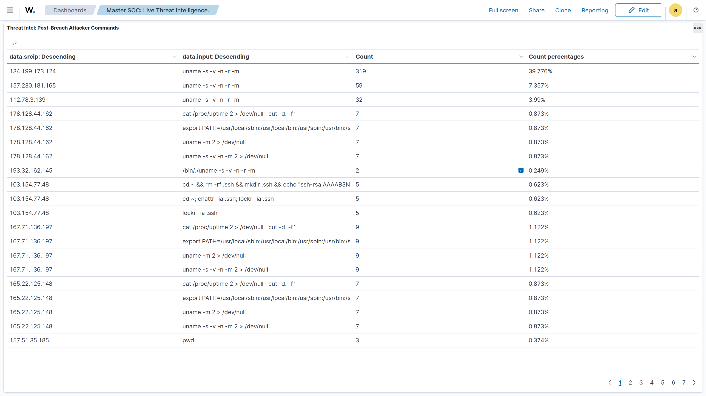

# Advanced Threat Intelligence Pipeline: Real-Time SSH Honeypot & SIEM 

## 📌 Project Overview
An end-to-end cyber threat intelligence pipeline designed to capture, normalize, and visualize live SSH brute-force attacks. This project utilizes a custom-configured Cowrie honeypot to safely trap threat actors, routing the telemetry through Wazuh SIEM and Filebeat processors for real-time GeoIP extraction and behavioral analysis in OpenSearch Dashboards.

## 👨‍💻 Author

<table align="center">
  <tr>
    <td align="center">
      <a href="https://github.com/IMMANUEL-88">
        
         
        <b>Immanuel Jeyam</b>
      </a>
    </td>
  </tr>
</table>

## 💡 Architecture Diagram

  

## 🛠️ Technology Stack
* **Security & SIEM:** Wazuh, Cowrie SSH Honeypot
* **Data Processing:** Filebeat (Pipeline Processors, String Manipulation)
* **Visualization:** OpenSearch Dashboards, Vega Visualization Grammar (TopoJSON)
* **Infrastructure:** Ubuntu Linux, `iptables` (Port Forwarding)

## 🚀 Key Engineering Features
* **Autonomous Threat Mapping:** Engineered a custom Vega script to render an `equalEarth` projection map, drawing live point-to-point flight paths from attacker coordinates to the destination server.
* **Data Normalization Pipeline:** Overcame GeoIP engine constraints by building a Filebeat pipeline that actively mutates raw JSON keys (e.g., `src_ip` to `srcip`) and injects static server coordinates mid-flight.
* **Post-Breach Analytics:** Designed custom data tables isolating advanced threat actor behavior, including tool fingerprinting (e.g., Zmap, Masscan) and malicious payload URL tracking.
* **Credential Tracking:** Configured real-time extraction and visualization of top dictionary attack credentials (usernames and passwords) via native JSON decoding.

## 📊 Live Dashboard Showcases

- **Live Threat Map & Geography Cloud Map**
  

- **Top 10 Attacker Usernamess and Passwords**
  

- **Attacker tool fingerprinting**
  

- **Post Breach Attacker Commands**
  

## 📂 Repository Contents
* `/dashboards` - Exported OpenSearch `.ndjson` files containing all custom visualizations and the Vega map script.
* `/configs` - Core configuration files including Filebeat pipelines, Cowrie setup, and iptables routing scripts.
